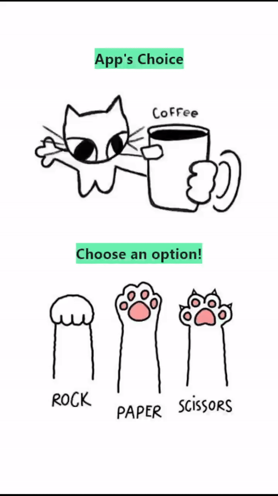

# Jokenpo

Pedra, Papel e Tesoura desenvolvido em Flutter.

## Instalação

Antes de começar a jogar, certifique-se de ter o ambiente de desenvolvimento Flutter configurado em sua máquina. Você pode seguir as instruções de instalação fornecidas na [documentação oficial do Flutter](https://flutter.dev/docs/get-started/install).

Depois de configurar o ambiente do Flutter, você pode clonar este repositório e executar o aplicativo em seu dispositivo ou emulador:

```bash
git clone https://github.com/seu-usuario/nome-do-repositorio.git
cd nome-do-repositorio
flutter run
```
<p align="center">
  
</p>
